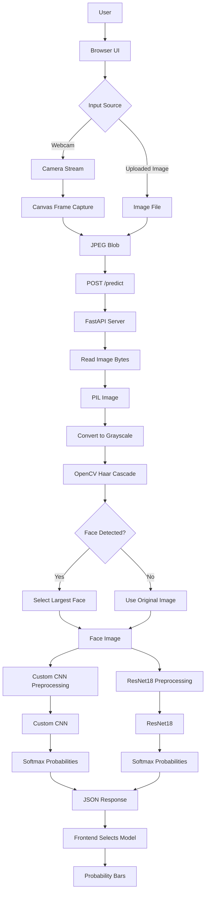
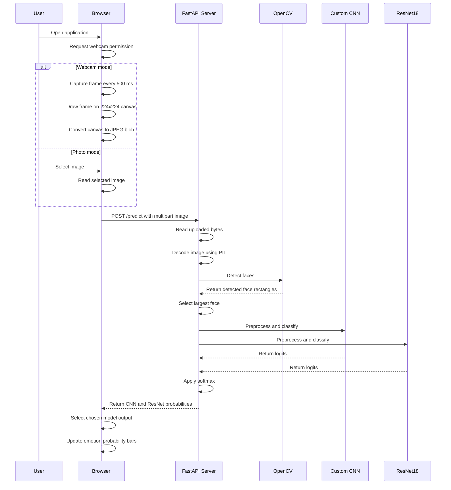
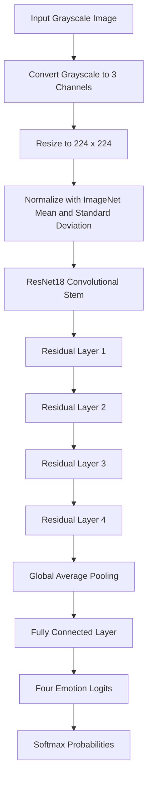

# Live Emotion Recognition — CNN vs ResNet18

A browser-based facial emotion recognition application that compares two deep learning models:

1. A custom convolutional neural network, referred to as **Custom CNN**
2. A pretrained-architecture-based **ResNet18** model

The application supports:

- Live webcam emotion recognition
- Emotion prediction from uploaded photographs
- Automatic face detection and largest-face cropping
- Side-by-side model inference through a shared API
- Probability visualization for four emotion classes
- CPU-based inference using PyTorch
- A FastAPI backend and a lightweight HTML/CSS/JavaScript frontend

The supported emotion classes are:

- Angry
- Happy
- Neutral
- Sad

---

## Table of Contents

- [Project Concept](#project-concept)
- [Main Objectives](#main-objectives)
- [Application Features](#application-features)
- [Repository Structure](#repository-structure)
- [System Architecture](#system-architecture)
- [End-to-End Processing Flow](#end-to-end-processing-flow)
- [Frontend Architecture](#frontend-architecture)
- [Backend Architecture](#backend-architecture)
- [Computer Vision Pipeline](#computer-vision-pipeline)
- [Deep Learning Concepts](#deep-learning-concepts)
- [Custom CNN Architecture](#custom-cnn-architecture)
- [ResNet18 Architecture](#resnet18-architecture)
- [Image Preprocessing](#image-preprocessing)
- [Model Inference](#model-inference)
- [Probability Interpretation](#probability-interpretation)
- [API Documentation](#api-documentation)
- [Installation](#installation)
- [Running the Application](#running-the-application)
- [Testing Inference from the Command Line](#testing-inference-from-the-command-line)
- [Using the Web Application](#using-the-web-application)
- [Sample Images](#sample-images)
- [Configuration](#configuration)
- [Important Implementation Details](#important-implementation-details)
- [Limitations](#limitations)
- [Security and Privacy Considerations](#security-and-privacy-considerations)
- [Potential Improvements](#potential-improvements)
- [Troubleshooting](#troubleshooting)
- [Summary](#summary)

---

## Project Concept

This project demonstrates how deep learning can be used to recognize the apparent emotional expression on a human face.

The user provides an image in one of two ways:

1. Through a live webcam stream
2. Through an uploaded image file

The browser converts the selected image or webcam frame into a JPEG image and sends it to the FastAPI backend. The backend then:

1. Reads the uploaded image
2. Converts the image into a format usable by the vision pipeline
3. Detects faces using OpenCV's Haar Cascade classifier
4. Selects the largest detected face
5. Sends the cropped face to both deep learning models
6. Converts the models' raw outputs into probabilities
7. Returns probabilities for all four emotion classes
8. Displays the results as animated horizontal bars in the browser

The central purpose of the project is not only to classify facial expressions, but also to compare the behavior of two different neural network designs:

- A small, custom CNN designed specifically for this four-class problem
- A ResNet18 architecture that uses residual connections and a deeper feature hierarchy

---

## Main Objectives

The project is designed to illustrate the following concepts:

- Image classification
- Facial-expression recognition
- Computer vision preprocessing
- Face detection
- CNN-based feature extraction
- Residual neural networks
- Transfer-learning-style model usage
- Model inference
- Softmax probability conversion
- REST-style API communication
- Browser webcam access
- Frontend-to-backend image upload
- Model comparison
- CPU inference using PyTorch

---

## Application Features

### 1. Live Webcam Mode

When the page loads, the browser requests webcam access using:

```javascript
navigator.mediaDevices.getUserMedia({ video: true })
```

Once permission is granted:

- The webcam stream is displayed in the browser
- A frame is captured every 500 milliseconds
- The frame is drawn onto a hidden 224 × 224 canvas
- The canvas content is converted to a JPEG blob
- The image is sent to the `/predict` endpoint
- The backend evaluates both models
- The selected model's probabilities are displayed

The webcam is not processed directly by Python. Instead, the browser captures frames and uploads them to the backend.

---

### 2. Photo Prediction Mode

The user can select an image from their computer.

After clicking **Predict from Photo**:

- The webcam prediction interval is stopped
- The uploaded image is displayed
- The image is sent to the backend
- Both models produce predictions
- The selected model's probabilities are rendered in the interface

---

### 3. Model Selection

The frontend provides a model selector with two choices:

```html
<option value="cnn">Custom CNN</option>
<option value="resnet">ResNet18</option>
```

The backend always computes predictions using both models:

```python
return {
    "cnn": predict(face, "cnn"),
    "resnet": predict(face, "resnet"),
}
```

The frontend decides which result to display based on the selected model.

This means the dropdown changes the visualization, not which model is executed on the server.

---

### 4. Face Detection

The backend uses OpenCV's Haar Cascade face detector:

```python
face_cascade = cv2.CascadeClassifier(
    cv2.data.haarcascades + "haarcascade_frontalface_default.xml"
)
```

If multiple faces are found, the largest face is selected:

```python
x, y, w_, h_ = max(faces, key=lambda f: f[2] * f[3])
```

If no face is detected, the original image is sent to the neural network models.

---

### 5. Probability Visualization

The four output values are converted into percentages in the browser:

```javascript
const pct = Math.round(probs[c] * 100);
```

The result is shown using animated bars for:

- Angry
- Happy
- Neutral
- Sad

The model returns probabilities rather than only the highest-probability emotion. This allows the user to see the model's confidence distribution across all classes.

---

## Repository Structure

```text
emotion-website/
├── index.html
├── inference.py
├── server.py
├── test_inference.py
├── requirements.txt
├── models/
│   ├── best_cnn.pth
│   └── best_resnet.pth
├── samples/
│   ├── angry.jpg
│   ├── happy.jpg
│   ├── neutral.jpg
│   └── sad.jpg
└── .gitignore
```

### `index.html`

The complete frontend application.

Responsibilities:

- Defines the user interface
- Requests webcam permissions
- Captures webcam frames
- Allows image uploads
- Sends image data to the backend
- Renders probability bars
- Switches between webcam and photo modes

The frontend is implemented using plain:

- HTML
- CSS
- JavaScript

There is no frontend framework such as React, Vue, or Angular.

---

### `server.py`

The FastAPI backend.

Responsibilities:

- Creates the FastAPI application
- Enables CORS
- Serves `index.html`
- Provides a health-check endpoint
- Accepts uploaded images
- Detects and crops the largest face
- Runs both deep learning models
- Returns JSON predictions

Main routes:

```text
GET  /
GET  /health
POST /predict
```

---

### `inference.py`

The model inference module.

Responsibilities:

- Defines the custom CNN architecture
- Loads the CNN checkpoint
- Loads the ResNet18 checkpoint
- Defines image preprocessing pipelines
- Caches loaded models
- Runs prediction
- Applies softmax
- Returns emotion probabilities

Important symbols:

```python
CLASSES
EmotionCNN
_load_cnn()
_load_resnet()
get_model()
predict()
```

---

### `test_inference.py`

A small command-line inference script.

It accepts an image path and runs both models:

```bash
python test_inference.py samples/happy.jpg
```

The output contains probability dictionaries for the CNN and ResNet18 models.

---

### `requirements.txt`

The Python dependencies required to run the application:

```text
fastapi
uvicorn[standard]
python-multipart
pillow
opencv-python-headless==4.10.0.84
numpy
torch
torchvision
```

The PyTorch CPU package index is also included:

```text
--extra-index-url https://download.pytorch.org/whl/cpu
```

This indicates that the project is intended to support CPU-based execution.

---

### `models/best_cnn.pth`

A PyTorch checkpoint containing the learned parameters for the custom CNN.

The model architecture must match the `EmotionCNN` class in `inference.py`.

The checkpoint is loaded using:

```python
m.load_state_dict(
    torch.load("models/best_cnn.pth", map_location=DEVICE)
)
```

---

### `models/best_resnet.pth`

A PyTorch checkpoint containing the learned parameters for the ResNet18-based model.

The architecture is reconstructed using:

```python
m = resnet18(weights=None)
m.fc = nn.Linear(m.fc.in_features, len(CLASSES))
```

The final fully connected layer is changed to produce four outputs.

---

### `samples/`

Example images for testing the application and command-line inference.

Available sample labels:

```text
samples/angry.jpg
samples/happy.jpg
samples/neutral.jpg
samples/sad.jpg
```

---

## System Architecture

The system consists of four major layers:

1. Browser presentation layer
2. FastAPI service layer
3. Computer vision preprocessing layer
4. Deep learning inference layer



---

## End-to-End Processing Flow



---

## Frontend Architecture

The frontend is a single static HTML page.

### User Interface Components

The page contains:

- Model selector
- File input
- Predict from Photo button
- Resume Webcam button
- Webcam video element
- Uploaded image preview
- Status message
- Four probability bars

Important frontend variables:

```javascript
const video = document.getElementById("video");
const uploadPreview = document.getElementById("uploadPreview");
const bars = document.getElementById("bars");
const status = document.getElementById("status");
const modeLabel = document.getElementById("mode");
const modelSelect = document.getElementById("modelSelect");
const CLASSES = ["angry", "happy", "neutral", "sad"];
const API = "/predict";
```

---

### Webcam Capture

The browser creates a hidden canvas:

```javascript
const canvas = document.createElement("canvas");
canvas.width = 224;
canvas.height = 224;
```

Each frame is copied from the webcam video:

```javascript
ctx.drawImage(video, 0, 0, canvas.width, canvas.height);
```

The frame is then converted into a JPEG blob:

```javascript
canvas.toBlob(async (blob) => {
    const data = await sendBlobToServer(blob);
}, "image/jpeg", 0.9);
```

The capture interval is:

```javascript
let liveInterval = setInterval(captureAndSend, 500);
```

Therefore, the browser attempts approximately two predictions per second.

---

### Sending an Image to the Backend

The frontend creates a multipart form:

```javascript
const form = new FormData();
form.append("file", blob, "frame.jpg");
```

The request is sent to the backend:

```javascript
const res = await fetch(API, {
    method: "POST",
    body: form
});
```

The response is expected to contain this structure:

```json
{
  "cnn": {
    "angry": 0.12,
    "happy": 0.61,
    "neutral": 0.20,
    "sad": 0.07
  },
  "resnet": {
    "angry": 0.08,
    "happy": 0.73,
    "neutral": 0.14,
    "sad": 0.05
  }
}
```

---

## Backend Architecture

The backend is built with FastAPI.

```python
app = FastAPI()
```

CORS is enabled globally:

```python
app.add_middleware(
    CORSMiddleware,
    allow_origins=["*"],
    allow_methods=["*"],
    allow_headers=["*"]
)
```

This allows browser requests from any origin. This is convenient for development, but it should be restricted in production.

---

### Root Endpoint

```python
@app.get("/")
def serve_frontend():
    return FileResponse("index.html")
```

The root endpoint serves the static frontend page.

The server expects `index.html` to be available in the current working directory.

---

### Health Endpoint

```python
@app.get("/health")
def health():
    return {"status": "ok"}
```

This endpoint can be used to verify that the backend is running.

Example response:

```json
{
  "status": "ok"
}
```

---

### Prediction Endpoint

```python
@app.post("/predict")
async def predict_endpoint(file: UploadFile = File(...)):
```

The endpoint expects a multipart form field named `file`.

Processing steps:

```python
image_bytes = await file.read()
img = Image.open(io.BytesIO(image_bytes))
face = crop_largest_face(img)
```

Both models are then evaluated:

```python
return {
    "cnn": predict(face, "cnn"),
    "resnet": predict(face, "resnet"),
}
```

---

## Computer Vision Pipeline

Before the image reaches the neural network, it passes through a traditional computer vision preprocessing stage.

### Step 1: Convert to Grayscale

The image is converted to grayscale for face detection:

```python
arr = np.array(pil_img.convert("L"))
```

A grayscale image contains one intensity channel rather than separate red, green, and blue channels.

---

### Step 2: Resize Small Images for Face Detection

If the input image is smaller than 300 pixels in its largest dimension, it is temporarily enlarged:

```python
if max(h, w) < 300:
    scale = 300 / max(h, w)
    arr_detect = cv2.resize(
        arr,
        (int(w * scale), int(h * scale))
    )
```

This is done to improve the Haar Cascade detector's ability to find small faces.

The detected coordinates are later scaled back to the original image dimensions.

---

### Step 3: Detect Faces

Faces are detected with:

```python
faces = face_cascade.detectMultiScale(
    arr_detect,
    scaleFactor=1.1,
    minNeighbors=5,
    minSize=(40, 40)
)
```

Important detector parameters:

- `scaleFactor=1.1`

  The image pyramid is reduced by approximately 10 percent at each scale.

- `minNeighbors=5`

  A detection must have enough neighboring detections to be considered reliable.

- `minSize=(40, 40)`

  Faces smaller than 40 × 40 pixels are ignored.

---

### Step 4: Select the Largest Face

When multiple faces are detected, the project chooses the face with the largest area:

```python
x, y, w_, h_ = max(
    faces,
    key=lambda f: f[2] * f[3]
)
```

The selected face is cropped from the original PIL image:

```python
return pil_img.crop((x, y, x + w_, y + h_))
```

This makes the system focus on the most prominent person in the image.

---

### Step 5: Fallback When No Face Is Found

If no face is detected:

```python
if len(faces) == 0:
    return pil_img
```

The complete original image is passed to the neural network.

This fallback prevents the request from failing, but it can reduce prediction quality because the model may receive background content or a full-body image instead of a cropped face.

---

## Deep Learning Concepts

### 1. Supervised Image Classification

The models perform supervised classification.

During training, each image is associated with a label such as:

```text
angry
happy
neutral
sad
```

The model learns a function that maps an input image to class scores:

```text
image → neural network → class scores
```

At inference time, the trained parameters are fixed and the model predicts the most likely emotion distribution.

---

### 2. Feature Learning

The neural networks do not rely on manually programmed rules such as:

- Detect raised eyebrows
- Detect a smiling mouth
- Detect a frown
- Detect narrowed eyes

Instead, convolutional layers learn visual patterns from data.

Early layers may learn features resembling:

- Edges
- Lines
- Simple curves
- Local brightness changes

Middle layers may learn:

- Eye regions
- Mouth shapes
- Nose structures
- Facial contours

Deeper layers may combine these patterns into expression-related representations.

---

### 3. Convolution

A convolutional layer applies learnable filters to an image.

For an input image \(X\) and a filter \(K\), a simplified convolution operation can be written as:

\[
Y(i,j) = \sum_m \sum_n X(i+m, j+n)K(m,n)
\]

Each filter responds to a specific visual pattern.

The network learns many filters, allowing it to detect different kinds of features.

---

### 4. Local Receptive Fields

Convolutional filters operate on small local regions of the input.

For example, a 3 × 3 convolution examines neighboring pixels and gradually builds larger contextual representations through successive layers.

This is useful for facial recognition because local structures such as eyes and mouths are important building blocks of expressions.

---

### 5. Parameter Sharing

The same convolutional filter is reused across different spatial positions.

This gives CNNs two major advantages:

- Fewer parameters than fully connected image models
- Ability to detect the same feature regardless of where it appears in the image

For example, a filter trained to detect an edge can detect that edge in multiple parts of a face.

---

### 6. ReLU Activation

The models use the Rectified Linear Unit activation function:

\[
\text{ReLU}(x) = \max(0,x)
\]

In PyTorch:

```python
nn.ReLU()
```

ReLU introduces non-linearity, allowing the network to learn complex patterns instead of only linear relationships.

---

### 7. Batch Normalization

The custom CNN uses batch normalization:

```python
nn.BatchNorm2d(cout)
```

Batch normalization normalizes intermediate activations and can help:

- Stabilize optimization
- Improve training convergence
- Reduce sensitivity to initialization
- Support deeper networks

During inference, the layer uses stored running statistics.

---

### 8. Pooling

The custom CNN uses max pooling:

```python
nn.MaxPool2d(2)
```

A 2 × 2 max-pooling layer reduces the spatial dimensions by selecting the largest value in each local window.

Pooling helps:

- Reduce computation
- Reduce feature map size
- Increase the effective receptive field
- Provide limited translation tolerance

---

### 9. Dropout

The custom CNN uses dropout:

```python
nn.Dropout(0.4)
```

Dropout randomly disables a portion of neurons during training.

This helps reduce overfitting by preventing the network from relying too heavily on a small set of features.

At inference time, dropout is disabled because the model is placed into evaluation mode:

```python
m.eval()
```

---

### 10. Fully Connected Classification

After convolutional feature extraction, the custom CNN flattens the feature maps and applies fully connected layers:

```python
nn.Flatten()
nn.Linear(128 * 6 * 6, 256)
nn.ReLU()
nn.Linear(256, n_classes)
```

The final layer outputs four raw values, one for each emotion class.

These values are called logits.

---

### 11. Logits

A logit is an unnormalized class score.

The final CNN and ResNet layers output four logits:

```text
[angry_score, happy_score, neutral_score, sad_score]
```

The logits do not directly represent probabilities. They can be negative, positive, or have any real-valued magnitude.

---

### 12. Softmax

The logits are converted into probabilities using softmax:

\[
P(y_i) =
\frac{e^{z_i}}
{\sum_j e^{z_j}}
\]

In PyTorch:

```python
probs = torch.softmax(logits, dim=1)[0]
```

The probabilities:

- Are between 0 and 1
- Sum approximately to 1
- Represent the model's relative confidence across the four classes

---

### 13. Argmax Classification

A traditional single-label prediction is obtained by selecting the class with the highest probability:

\[
\hat{y} = \arg\max_i P(y_i)
\]

This project returns all probabilities instead of only the winning label, allowing the UI to visualize uncertainty.

---

## Custom CNN Architecture

The custom CNN is defined in the `EmotionCNN` class.

```python
class EmotionCNN(nn.Module):
```

Its feature extractor is:

```python
self.features = nn.Sequential(
    block(1, 32),
    block(32, 64),
    block(64, 128)
)
```

Each block contains:

```python
nn.Conv2d(...)
nn.BatchNorm2d(...)
nn.ReLU()
nn.Conv2d(...)
nn.BatchNorm2d(...)
nn.ReLU()
nn.MaxPool2d(2)
```

### Custom CNN Structure


### CNN Input Shape

The custom CNN preprocessing pipeline is:

```python
_cnn_transform = T.Compose([
    T.Resize((48, 48)),
    T.ToTensor(),
    T.Normalize([FER_MEAN], [FER_STD])
])
```

The input is converted to grayscale:

```python
img = pil_image.convert("L")
```

Therefore, the input tensor has the shape:

```text
1 × 48 × 48
```

After three 2 × 2 pooling operations:

```text
48 × 48 → 24 × 24 → 12 × 12 → 6 × 6
```

The final feature map has:

```text
128 × 6 × 6
```

This explains the classifier input dimension:

```python
nn.Linear(128 * 6 * 6, 256)
```

which equals:

```text
4608 input features
```

---

## ResNet18 Architecture

The second model is based on ResNet18 from torchvision:

```python
m = resnet18(weights=None)
```

The final layer is replaced:

```python
m.fc = nn.Linear(
    m.fc.in_features,
    len(CLASSES)
)
```

Since there are four emotion classes, the final layer produces four logits.

### What ResNet Means

ResNet stands for Residual Network.

Its defining concept is the residual connection.

Instead of forcing a block to learn a complete transformation \(H(x)\), a residual block learns a residual function \(F(x)\):

\[
H(x) = F(x) + x
\]

The original input \(x\) is added directly to the learned transformation.

---

### Why Residual Connections Help

As neural networks become deeper, they can suffer from:

- Vanishing gradients
- Optimization difficulty
- Degradation problems
- Difficulty learning identity mappings

Residual connections create a shorter path for information and gradients to flow through the network.

This makes it easier to train deeper architectures.

---

### ResNet18 Processing Pipeline



---

### ResNet Input Preprocessing

The ResNet preprocessing pipeline is:

```python
_resnet_transform = T.Compose([
    T.Resize((IMG_SIZE_RESNET, IMG_SIZE_RESNET)),
    T.Grayscale(num_output_channels=3),
    T.ToTensor(),
    T.Normalize(
        [0.485, 0.456, 0.406],
        [0.229, 0.224, 0.225]
    )
])
```

The image is initially converted to grayscale, then replicated into three channels:

```python
T.Grayscale(num_output_channels=3)
```

This produces a three-channel tensor compatible with the standard ResNet18 input format.

The final input shape is:

```text
3 × 224 × 224
```

---

## Model Comparison

| Feature | Custom CNN | ResNet18 |
|---|---|---|
| Architecture | Small custom CNN | Residual network |
| Input size | 48 × 48 | 224 × 224 |
| Input channels | 1 grayscale channel | 3 replicated grayscale channels |
| Feature extraction | Three custom convolutional blocks | ResNet residual blocks |
| Skip connections | No | Yes |
| Regularization | Batch normalization and dropout | ResNet architecture and learned weights |
| Output classes | 4 | 4 |
| Model file | `models/best_cnn.pth` | `models/best_resnet.pth` |
| Inference device | CPU | CPU |
| Main educational value | Understand CNN fundamentals | Understand deeper residual architectures |

The application is useful for comparing:

- Model size
- Input resolution
- Feature extraction depth
- Prediction confidence
- Effects of architecture design
- Behavior of custom versus established neural network designs

The repository does not include training scripts, validation metrics, accuracy reports, confusion matrices, or dataset preparation code. Therefore, model quality should not be inferred solely from the architecture names.

---

## Image Preprocessing

The same face crop is passed to both models, but each model has its own preprocessing pipeline.

### Shared Preprocessing

Both models begin with:

```python
img = pil_image.convert("L")
```

This converts the image to grayscale.

---

### CNN Preprocessing

```python
T.Resize((48, 48))
T.ToTensor()
T.Normalize([0.4924], [0.2532])
```

The CNN receives:

```text
1 × 48 × 48
```

The normalization values are:

```text
Mean: 0.4924
Standard deviation: 0.2532
```

These values should correspond to the data distribution expected during CNN training.

---

### ResNet Preprocessing

```python
T.Resize((224, 224))
T.Grayscale(num_output_channels=3)
T.ToTensor()
T.Normalize(
    [0.485, 0.456, 0.406],
    [0.229, 0.224, 0.225]
)
```

The ResNet receives:

```text
3 × 224 × 224
```

The normalization values are the common ImageNet normalization constants used by many torchvision models.

Because this ResNet is loaded with:

```python
resnet18(weights=None)
```

the checkpoint must contain the appropriate trained parameters. The model is not downloading weights from the internet at runtime.

---

## Model Inference

Models are loaded lazily and cached.

The cache is defined as:

```python
_models = {}
```

The model-loading function is:

```python
def get_model(name):
    if name not in _models:
        _models[name] = {
            "cnn": _load_cnn,
            "resnet": _load_resnet
        }[name]()
    return _models[name]
```

This means:

- The model is not loaded until it is needed
- Each model is loaded only once per server process
- Later requests reuse the in-memory model
- Reusing models avoids repeatedly reading large checkpoint files

---

### Evaluation Mode

Both models are placed into evaluation mode:

```python
m.eval()
```

This is important because layers such as dropout and batch normalization behave differently during training and inference.

---

### Disable Gradient Calculation

The prediction function uses:

```python
with torch.no_grad():
```

This disables gradient tracking.

Benefits:

- Lower memory usage
- Faster inference
- No unnecessary computational graph construction

---

### Prediction Function

The central inference function is:

```python
def predict(pil_image, model_name="cnn"):
    img = pil_image.convert("L")
    model = get_model(model_name)
    transform = (
        _cnn_transform
        if model_name == "cnn"
        else _resnet_transform
    )
    x = transform(img).unsqueeze(0)

    with torch.no_grad():
        logits = model(x)
        probs = torch.softmax(logits, dim=1)[0]

    return {
        CLASSES[i]: round(float(probs[i]), 4)
        for i in range(len(CLASSES))
    }
```

The `unsqueeze(0)` operation adds the batch dimension.

For example:

```text
1 × 48 × 48
```

becomes:

```text
1 × 1 × 48 × 48
```

for the CNN.

For ResNet:

```text
3 × 224 × 224
```

becomes:

```text
1 × 3 × 224 × 224
```

---

## Probability Interpretation

An example response may look like:

```json
{
  "angry": 0.0342,
  "happy": 0.8125,
  "neutral": 0.1031,
  "sad": 0.0502
}
```

The largest probability is `happy`, so the model's predicted class would be:

```text
happy
```

However, these probabilities should be interpreted as model confidence scores, not guaranteed psychological truth.

A high probability does not prove that a person is actually experiencing an emotion. It only indicates that the facial image resembles patterns associated with that class in the model's training data.

---

## API Documentation

### `GET /`

Serves the frontend application.

#### Response

Returns the contents of:

```text
index.html
```

---

### `GET /health`

Checks whether the backend is running.

#### Example Request

```bash
curl http://127.0.0.1:10000/health
```

#### Example Response

```json
{
  "status": "ok"
}
```

---

### `POST /predict`

Accepts an image and returns predictions from both models.

#### Request Format

The request must use `multipart/form-data`.

The required field name is:

```text
file
```

#### Example Request

```bash
curl -X POST \
  -F "file=@samples/happy.jpg" \
  http://127.0.0.1:10000/predict
```

#### Example Response

```json
{
  "cnn": {
    "angry": 0.05,
    "happy": 0.78,
    "neutral": 0.12,
    "sad": 0.05
  },
  "resnet": {
    "angry": 0.03,
    "happy": 0.84,
    "neutral": 0.09,
    "sad": 0.04
  }
}
```

The exact values depend on the image and the trained checkpoints.

---

## Installation

### Prerequisites

Install the following before starting:

- Python 3.9 or newer
- `pip`
- A modern web browser
- Webcam access if using live mode
- Sufficient disk space for the PyTorch dependencies and model checkpoints

---

### Clone the Repository

```bash
git clone https://github.com/Neha020305/emotion-website.git
cd emotion-website
```

---

### Create a Virtual Environment

#### Linux or macOS

```bash
python3 -m venv .venv
source .venv/bin/activate
```

#### Windows PowerShell

```powershell
python -m venv .venv
.venv\Scripts\Activate.ps1
```

#### Windows Command Prompt

```cmd
python -m venv .venv
.venv\Scripts\activate
```

---

### Install Dependencies

```bash
pip install -r requirements.txt
```

The requirements install:

- FastAPI
- Uvicorn
- Multipart form support
- Pillow
- OpenCV
- NumPy
- PyTorch
- Torchvision

The project uses the CPU PyTorch package index specified in `requirements.txt`.

---

## Running the Application

Start the FastAPI server with:

```bash
python server.py
```

The server starts on:

```text
http://0.0.0.0:10000
```

Open the application in a browser at:

```text
http://127.0.0.1:10000
```

The default port is configured in `server.py`:

```python
port = int(os.environ.get("PORT", 10000))
```

---

### Running with Uvicorn Directly

The server can also be started using Uvicorn:

```bash
uvicorn server:app --host 0.0.0.0 --port 10000
```

For development with automatic reload:

```bash
uvicorn server:app --host 0.0.0.0 --port 10000 --reload
```

The reload mode is useful during development but is generally not intended for production deployment.

---

### Running on a Different Port

Linux or macOS:

```bash
PORT=8080 python server.py
```

Windows PowerShell:

```powershell
$env:PORT=8080
python server.py
```

The application will then be available at:

```text
http://127.0.0.1:8080
```

---

## Testing Inference from the Command Line

The repository includes `test_inference.py`.

Run it with a sample image:

```bash
python test_inference.py samples/happy.jpg
```

Other examples:

```bash
python test_inference.py samples/angry.jpg
python test_inference.py samples/neutral.jpg
python test_inference.py samples/sad.jpg
```

The script executes:

```python
predict(img, "cnn")
predict(img, "resnet")
```

and prints both probability dictionaries.

Example output format:

```text
CNN:    {'angry': 0.10, 'happy': 0.70, 'neutral': 0.15, 'sad': 0.05}
ResNet: {'angry': 0.08, 'happy': 0.76, 'neutral': 0.11, 'sad': 0.05}
```

---

## Using the Web Application

1. Start the backend server:

   ```bash
   python server.py
   ```

2. Open the application:

   ```text
   http://127.0.0.1:10000
   ```

3. Allow camera access if using webcam mode.

4. Select a model:

   - Custom CNN
   - ResNet18

5. Choose one of the following:

   - Continue in webcam mode
   - Select an image and click **Predict from Photo**

6. Observe the probability bars.

7. Click **Resume Webcam** to return to live prediction after photo mode.

---

## Sample Images

The repository contains four sample images:

```text
samples/angry.jpg
samples/happy.jpg
samples/neutral.jpg
samples/sad.jpg
```

These can be used for:

- Testing the command-line inference script
- Testing the `/predict` endpoint
- Checking whether the model files load correctly
- Demonstrating the web interface

Example API test:

```bash
curl -X POST \
  -F "file=@samples/angry.jpg" \
  http://127.0.0.1:10000/predict
```

---

## Configuration

### Emotion Classes

The emotion classes are defined in `inference.py`:

```python
CLASSES = ["angry", "happy", "neutral", "sad"]
```

The order is important because model output index `0`, `1`, `2`, and `3` are mapped to these labels respectively.

If the class order is changed, the trained checkpoints and frontend must be kept consistent.

---

### Inference Device

The project explicitly uses CPU:

```python
DEVICE = torch.device("cpu")
```

Checkpoints are loaded with:

```python
map_location=DEVICE
```

This allows models trained or saved on another device to be loaded onto the CPU.

---

### Server Port

The port is read from the environment:

```python
port = int(os.environ.get("PORT", 10000))
```

If `PORT` is not defined, the application uses port `10000`.

---

### Webcam Frequency

The frontend sends a webcam frame every 500 milliseconds:

```javascript
setInterval(captureAndSend, 500)
```

This is approximately two requests per second.

Increasing the interval reduces server load:

```javascript
setInterval(captureAndSend, 1000)
```

Reducing the interval increases responsiveness but also increases:

- CPU usage
- Network traffic
- Request frequency
- Potential request overlap

---

## Important Implementation Details

### Both Models Run for Every Request

The backend returns both model predictions:

```python
return {
    "cnn": predict(face, "cnn"),
    "resnet": predict(face, "resnet"),
}
```

Even if the user selects only one model in the frontend, both models are evaluated.

This is useful for comparison but less efficient than running only the selected model.

---

### Model Loading Is Cached

The first request that uses a model loads its checkpoint.

Subsequent requests reuse the loaded model because of:

```python
_models = {}
```

This avoids repeated disk access.

---

### Face Detection Is Separate from Neural Network Classification

OpenCV Haar Cascade detection is not the same as the deep learning emotion classifier.

The pipeline contains two different machine learning/computer vision stages:

```text
Face detection → Emotion classification
```

Face detection determines where the face is.

Emotion classification predicts the expression represented by the face crop.

---

### The Frontend Uses Relative API Paths

The frontend sends requests to:

```javascript
const API = "/predict";
```

This works when the frontend is served by the same FastAPI server.

If `index.html` is opened directly from the filesystem using a `file://` URL, the relative API path will not work correctly. The page should be accessed through the FastAPI server.

---

### The Webcam Preview Is Mirrored

The webcam video uses:

```css
transform: scaleX(-1);
```

This creates a mirror-like preview similar to common video-call applications.

The uploaded photo preview is not mirrored:

```css
img#uploadPreview {
    transform: none;
}
```

---

### The Browser Requests Camera Permission

Webcam mode depends on:

```javascript
navigator.mediaDevices.getUserMedia({ video: true })
```

Camera access may require:

- User permission
- A secure context
- `localhost` or HTTPS
- Browser support for the MediaDevices API

---

## Limitations

### 1. No Training Code Is Included

The repository includes model checkpoints but does not include:

- Dataset download scripts
- Dataset preprocessing scripts
- Training loops
- Loss functions
- Optimizers
- Learning-rate schedules
- Validation code
- Model evaluation metrics
- Confusion matrices
- Training history

The repository is primarily an inference and demonstration application.

---

### 2. Facial Expression Is Not the Same as True Emotion

The models classify visible facial-expression patterns.

They cannot reliably determine:

- A person's private emotional state
- Intentions
- Mental health
- Personality
- Contextual feelings
- Mixed or hidden emotions

The results should be treated as an estimated visual classification, not psychological diagnosis.

---

### 3. Only Four Classes Are Supported

The model output is limited to:

```text
angry, happy, neutral, sad
```

Other states such as fear, surprise, disgust, confusion, or contempt are not available.

---

### 4. Largest-Face Strategy

If multiple people appear in an image, only the largest detected face is classified.

The application does not return predictions for every detected face.

---

### 5. No-Face Fallback May Reduce Accuracy

If no face is detected, the entire original image is sent to the model.

This can produce unreliable predictions when:

- The image contains a small face
- The image has a complex background
- The person is far from the camera
- The face is rotated
- Lighting is poor

---

### 6. CPU Inference May Be Slow

The application uses:

```python
DEVICE = torch.device("cpu")
```

The ResNet18 model may require more computation than the custom CNN, especially when processing frequent webcam frames.

---

### 7. Requests Can Overlap

The webcam capture interval is fixed at 500 milliseconds. If inference takes longer than 500 milliseconds, new requests may be created before older requests finish.

A production version should coordinate requests so only one prediction is active at a time.

---

### 8. CORS Is Open to Every Origin

The backend currently uses:

```python
allow_origins=["*"]
```

This is convenient for development but should be restricted in production.

---

### 9. No File Size or Type Validation

The backend accepts an uploaded file and attempts to open it using PIL.

A production deployment should validate:

- File extension
- MIME type
- File size
- Image dimensions
- Corrupt image handling

---

## Security and Privacy Considerations

The application processes facial images, which may be sensitive personal data.

Recommended production practices include:

- Do not permanently store uploaded images unless necessary
- Use HTTPS
- Restrict CORS origins
- Validate uploads
- Add request-rate limits
- Avoid logging raw image contents
- Explain how images are processed
- Obtain user consent for camera access
- Delete temporary files if any are introduced
- Avoid using predictions for high-impact decisions
- Clearly communicate that predictions are approximate

The current implementation processes the image in memory and does not explicitly save uploaded images to disk.

---

## Potential Improvements

### 1. Run Only the Selected Model

The frontend could send the selected model name:

```javascript
form.append("model", modelSelect.value);
```

The backend could then execute only that model.

This would reduce CPU usage and latency.

---

### 2. Return the Predicted Label

The backend currently returns only probabilities.

It could also return:

```json
{
  "label": "happy",
  "confidence": 0.84,
  "probabilities": {
    "angry": 0.03,
    "happy": 0.84,
    "neutral": 0.09,
    "sad": 0.04
  }
}
```

---

### 3. Improve Face Detection

Possible alternatives include:

- RetinaFace
- MTCNN
- MediaPipe Face Detection
- OpenCV DNN face detector
- YOLO-based face detectors

These may perform better under:

- Different poses
- Low lighting
- Occlusion
- Multiple faces
- Small faces

---

### 4. Add Face Bounding Box Visualization

The backend could return face coordinates and the frontend could draw a bounding box around the detected face.

---

### 5. Add Request Synchronization

The frontend could prevent overlapping requests:

```javascript
let predictionInProgress = false;
```

Before sending a request:

```javascript
if (predictionInProgress) return;
predictionInProgress = true;
```

After receiving a response:

```javascript
predictionInProgress = false;
```

---

### 6. Add Model Evaluation Metrics

A complete machine learning project could include:

- Accuracy
- Precision
- Recall
- F1-score
- Confusion matrix
- Per-class accuracy
- ROC-AUC where appropriate
- Calibration metrics
- Comparison of CNN and ResNet latency

---

### 7. Add Training Documentation

The project could be expanded with:

- Dataset description
- Dataset split strategy
- Data augmentation
- Training hyperparameters
- Loss function
- Optimizer
- Number of epochs
- Early stopping
- Checkpoint selection criteria
- Reproducibility instructions

---

### 8. Add Docker Support

A `Dockerfile` could make deployment easier and ensure consistent dependency versions.

---

### 9. Add Automated Tests

Potential tests include:

- Health endpoint test
- Prediction endpoint test
- Invalid image test
- Missing file test
- Face-cropping test
- Model-loading test
- Output probability sum test
- Output class-key test

---

### 10. Improve Production Deployment

For deployment, consider:

- Gunicorn with Uvicorn workers
- HTTPS
- Reverse proxy such as Nginx
- Restricted CORS
- Authentication if required
- Structured logging
- Monitoring
- Health checks
- Request timeouts
- Containerized deployment

---

## Troubleshooting

### The Server Cannot Find the Model Files

The model paths are relative:

```python
models/best_cnn.pth
models/best_resnet.pth
```

Start the server from the repository root:

```bash
cd emotion-website
python server.py
```

Do not start it from a different directory unless the code is updated to use absolute paths based on `__file__`.

---

### The Browser Cannot Access the Camera

Check that:

- Camera permission was granted
- Another application is not using the camera
- The browser supports `getUserMedia`
- The application is opened through `localhost` or HTTPS
- The camera is available to the operating system

---

### The Page Loads but Predictions Fail

Verify the backend health endpoint:

```bash
curl http://127.0.0.1:10000/health
```

Expected response:

```json
{
  "status": "ok"
}
```

Then test the API directly:

```bash
curl -X POST \
  -F "file=@samples/happy.jpg" \
  http://127.0.0.1:10000/predict
```

---

### PyTorch Installation Problems

Try upgrading packaging tools:

```bash
python -m pip install --upgrade pip setuptools wheel
```

Then reinstall:

```bash
pip install -r requirements.txt
```

For CPU-only environments, ensure that the PyTorch CPU package source in `requirements.txt` is being used.

---

### OpenCV Face Detection Does Not Find a Face

Possible causes include:

- Face is too small
- Face is heavily rotated
- Image is dark
- Face is occluded
- Low-resolution input
- Unusual background
- Non-frontal face

The current fallback sends the full image to the model when no face is detected.

---

### Predictions Are Slow

Possible reasons:

- CPU-only inference
- ResNet18 processing
- Two models run for every request
- Webcam requests are sent every 500 milliseconds
- Several requests may overlap

Possible solutions:

- Run only the selected model
- Increase the webcam interval
- Add request synchronization
- Use a GPU
- Reduce input frequency
- Batch requests where appropriate
- Use a smaller model

---

## Summary

This repository is an end-to-end facial emotion recognition demonstration.

Its architecture combines:

```text
Browser webcam or image upload
        ↓
FastAPI image API
        ↓
OpenCV face detection
        ↓
Largest-face cropping
        ↓
CNN and ResNet18 preprocessing
        ↓
PyTorch model inference
        ↓
Softmax probabilities
        ↓
Frontend visualization
```

The main educational value of the project is the comparison between:

- A compact custom CNN
- A deeper ResNet18 model with residual connections

The custom CNN demonstrates the fundamental building blocks of image classification:

- Convolution
- Batch normalization
- ReLU activation
- Max pooling
- Dropout
- Fully connected layers
- Softmax output

The ResNet18 model demonstrates more advanced deep learning concepts:

- Deep feature hierarchies
- Residual learning
- Skip connections
- Global average pooling
- Transfer-learning-compatible architecture design

The application is suitable as a demonstration, academic project, or starting point for a more advanced emotion-recognition system. For production usage, it would require stronger validation, improved face detection, security hardening, better request management, model evaluation, and careful consideration of privacy and ethical limitations.
